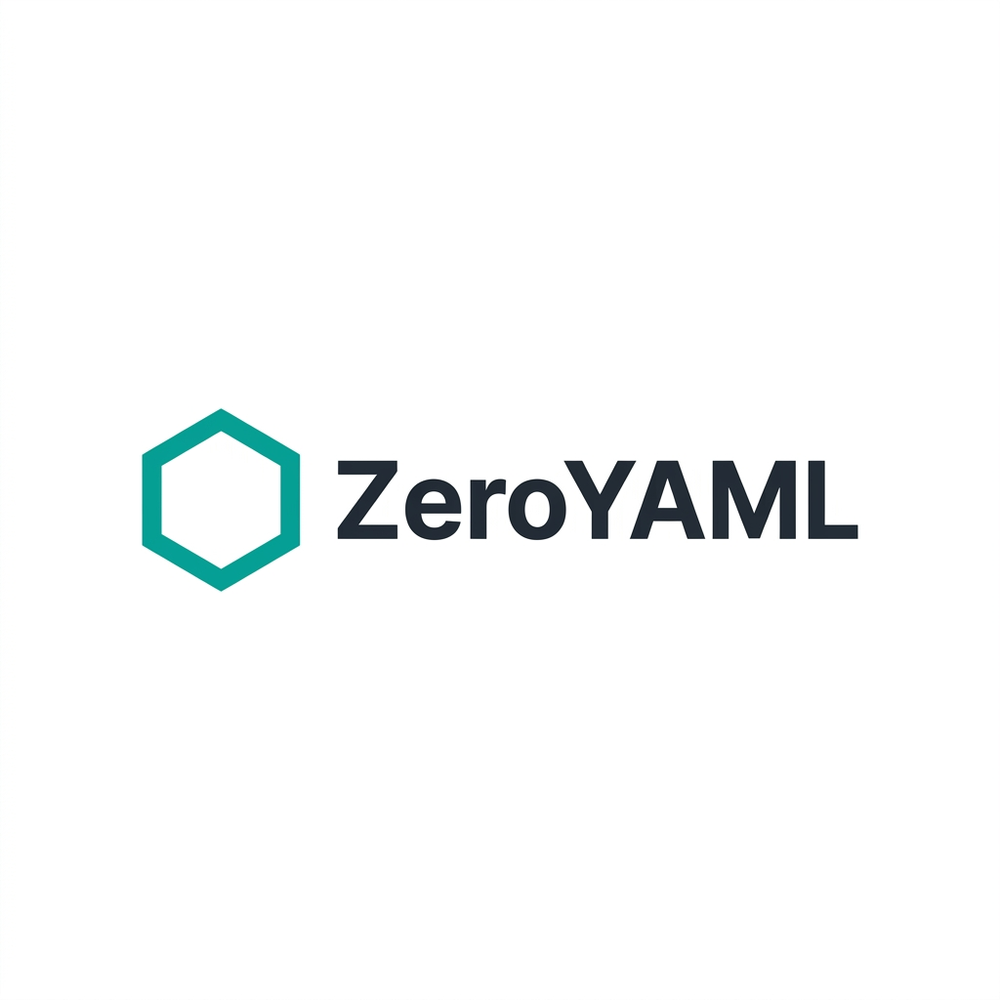

# 🚀 ZeroYAML: Zero-effort Configuration for Modern DevOps.

ZeroYAML is an intuitive, visual configurator for your container-native infrastructure. Generate production-ready **Dockerfiles**, **Docker Compose** files, and **Kubernetes manifests** through a sleek, modernized interface—without writing a single line of YAML from scratch.

<p align="center">
  
  
  
  
</p>

<p align="center">
  
</p>
   
## ✨ Key Features

- **🚀 Triple-Stack Generation**: Seamlessly toggle between Dockerfile, Docker Compose, and Kubernetes manifests.
- **📝 Direct Edit Mode**: Need to tweak a generated file? Hit the **"Direct Edit"** button to jump into a full-featured Monaco editor.
- **🌓 Dynamic Themes**: Fully optimized for both Dark and Light modes with a premium, glassmorphism-inspired design.
- **📦 Modular Component System**: A unified UI library built for developer speed and visual consistency.
- **🛡️ Real-time Synchronization**: Every toggle, input, and configuration change is instantly reflected in the live preview.
- **📥 One-Click Export**: Copy to clipboard or download your configuration files directly.
- **🌐 Bilingual Localization**: Full support for both **English** and **Chinese** (Simplified), including reactive code comments and UI labels.

## 🛠️ Technology Stack

- **Framework**: [Next.js 15+](https://nextjs.org) (App Router)
- **Editor**: [Monaco Editor](https://microsoft.github.io/monaco-editor/) (via `@monaco-editor/react`)
- **State Management**: [Zustand](https://github.com/pmndrs/zustand)
- **Styling**: [Tailwind CSS 4](https://tailwindcss.com) & [Lucide Icons](https://lucide.dev)
- **Theming**: `next-themes`

## 🚀 Getting Started

### Prerequisites

- Node.js 18.17.0 or later
- npm or pnpm

### Installation

1. Clone the repository:
   ```bash
   git clone https://github.com/hillzhang/ZeroYAML.git
   cd ZeroYAML
   ```

2. Install dependencies:
   ```bash
   npm install
   ```

3. Run the development server:
   ```bash
   npm run dev
   ```

4. Open [http://localhost:3000](http://localhost:3000) with your browser to start configuring.

## 📁 Project Structure

```bash
src/
├── app/             # Next.js App Router (pages & layout)
├── components/      
│   ├── preview/     # Monaco Editor & Code Viewer logic
│   ├── tabs/        # Specific logic for Docker/Compose/K8s
│   └── ui/          # Generic, reusable UI components
├── hooks/           # Custom React hooks (i18n & Code Gen)
├── i18n/            # Localization dictionaries (zh/en)
├── store/           # Zustand store definitions
└── types/           # Global TypeScript definitions
```

## 🤝 Contributing

Contributions are what make the open-source community such an amazing place to learn, inspire, and create. Any contributions you make are **greatly appreciated**.

1. Fork the Project
2. Create your Feature Branch (`git checkout -b feature/AmazingFeature`)
3. Commit your Changes (`git commit -m 'Add some AmazingFeature'`)
4. Push to the Branch (`git push origin feature/AmazingFeature`)
5. Open a Pull Request

## 📄 License

Distributed under the MIT License. See `LICENSE` for more information.

---
Built with ❤️ by [hillzhang](https://github.com/hillzhang)
